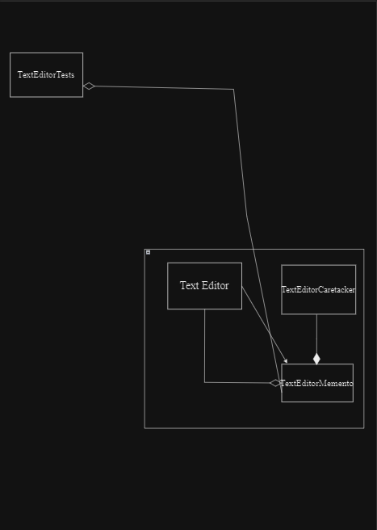

# Memento
# Design Pattern: Memento Pattern

## Overview

Software design patterns are programming paradigms that describe reusable solutions to common design problems. They provide a set of tried and tested solutions that can be applied to various situations, aiding in creating robust and maintainable software. The Memento design pattern is one such pattern.

The Memento pattern falls under the behavioral design patterns category. It addresses the need to capture and externalize an object's internal state, allowing it to be restored to that state at a later point in time. This pattern is particularly useful when dealing with undo mechanisms, history tracking, and preserving the state of an object for various purposes.

## Memento Design Pattern

The Memento design pattern consists of three main components:

1. **Originator**: Represents the object whose state needs to be saved and restored. In our example, a `TextEditor` is the originator, and it maintains the text content.

2. **Memento**: Represents the saved state of the originator. It stores the relevant state information. In our example, `TextEditorMemento` serves as the memento and encapsulates the saved text.

3. **Caretaker**: Manages and keeps track of mementos. It provides a way to save and restore the originator's state. In our example, `TextEditorCaretaker` is the caretaker.

## Class Diagram

## Real-World Applications

The Memento design pattern finds applications in various scenarios, including:

- **Undo/Redo Mechanisms**: It can be used to implement undo and redo functionality in applications where users need to revert to previous states.

- **Version Control Systems**: Mementos can be likened to snapshots or commits in version control systems, allowing you to go back to previous code versions.

- **Text Editors**: Text editors can use the Memento pattern to save and restore document states, enabling users to undo changes.

- **Gaming**: In games, it can be used to save and load game states or checkpoints.

## Conclusion

The Memento design pattern is a valuable tool in managing object states. It allows you to capture and restore an object's state without exposing its internal details. Whether you're building text editors, games, or applications with undo functionality, the Memento pattern can help you maintain a robust and user-friendly experience.

In this example, we demonstrated the Memento pattern using a simple text editor application. However, its applicability extends to a wide range of software systems where state management is essential.
